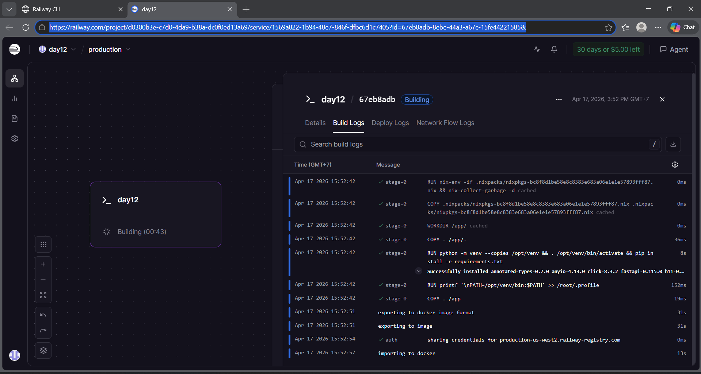

#  Delivery Checklist — Day 12 Lab Submission

> **Student Name:** Lê Nguyễn Chí Bảo  
> **Student ID:** 2A202600103  
> **Date:** 17/4/2026

---

##  Submission Requirements

Submit a **GitHub repository** containing:

### 1. Mission Answers (40 points)

Create a file `MISSION_ANSWERS.md` with your answers to all exercises:

```markdown
# Day 12 Lab - Mission Answers

## Part 1: Localhost vs Production

### Exercise 1.1: Anti-patterns found
1. Hardcoded secret trong code: `OPENAI_API_KEY = "sk-hardcoded-fake-key-never-do-this"`.
2. Hardcoded thông tin database (`DATABASE_URL`) gồm username/password.
3. Không có config management theo environment variables (`DEBUG`, `MAX_TOKENS` bị hardcode).
4. Dùng `print()` thay vì structured logging (khó monitor/trace trong production).
5. Log lộ secret: in trực tiếp API key ra log (`Using key: ...`).
6. Thiếu health check endpoint (`/health`) cho platform orchestration.
7. Bind host `localhost` nên không nhận kết nối từ ngoài container/service network.
8. Port hardcode `8000`, không đọc `PORT` từ môi trường cloud.
9. `reload=True` trong runtime, không phù hợp production workload.

### Exercise 1.3: Comparison table
| Feature | Develop | Production | Why Important? |
|---------|---------|------------|----------------|
| Config  | Hardcode: Ghi trực tiếp API KEY, DB URL vào file code | Env variables: sử dụng qua file config.py | Tránh lộ thông tin nhạy cảm (secrets) khi push code lên Git; dễ dàng thay đổi cấu hình mà không cần sửa code. |
| Health check | Không có: chỉ có logic chính của agent | Có: enpoint /health, /ready và /metrics | Giúp các nền tảng Cloud biết khi nào Agent bị treo để tự động khởi động lại, hoặc khi nào đủ sẵn sàng để nhận traffic |
| Logging | print(): in ra toàn bộ thông tin log, có thể chứa thông tin nhạy cảm  | JSON: Log ra định dạng JSON chuẩn hóa | Giúp các công cụ quản lý log dễ dàng tìm kiếm và phân tích lỗi; ngăn chặn việc ghi đè thông tin bảo mật vào log file. |
| Shutdown | Đột ngột | Cẩn thận: xử lý SIGTERM và sử dụng lifespan | Đảm bảo các yêu cầu đang xử lý dở dang được hoàn tất và các kết nối cơ sở dữ liệu được đóng an toàn trước khi tắt hoàn toàn app. |
...

## Part 2: Docker

### Exercise 2.1: Dockerfile questions
1. Base image: "python:3.11"
2. Working directory: "/app"
3. Việc cài đặt thư viện thường sẽ tốn nhiều thời gian do đó COPY requirements.txt trước và chạy lệnh "RUN pip install --no-cache-dir -r requirements.txt" trước để tối ưu về mặt thời gian. Ngoài ra Docker layer Cache sẽ giữ lại bản sao của tầng này, nếu những lần sau chỉ sửa code thì sẽ tránh phải cài đặt lại các thư viện
4. - CMD đưa ra các tham số mặc định cho container, có thể override bằng cách thêm lệnh mới khi chạy docker run
   - ENTRYPOINT là lệnh chính cố định của container

### Exercise 2.3: Image size comparison
- Develop: 1.66 GB
- Production: 185.82 MB
- Difference: ~9.15%

## Part 3: Cloud Deployment

### Exercise 3.1: Railway deployment
- URL: https://day12-production-ec4c.up.railway.app
- Screenshot: 

## Part 4: API Security
GET https://day12-production-ec4c.up.railway.app/health
{
    "status": "ok",
    "uptime_seconds": 184.6,
    "platform": "Railway",
    "timestamp": "2026-04-17T08:56:46.302228+00:00"
}

POST https://day12-production-ec4c.up.railway.app/ask
{
    "question": "What is Docker?",
    "answer": "Container là cách đóng gói app để chạy ở mọi nơi. Build once, run anywhere!",
    "platform": "Railway"
}

### Exercise 4.1: API Key authentication

- API key được kiểm tra ở dependency `verify_api_key()` trong `04-api-gateway/develop/app.py`.
- Nếu thiếu key: trả về `401` với message `Missing API key...`.
- Nếu key sai: trả về `403` với message `Invalid API key.`
- Rotate key: đổi biến môi trường `AGENT_API_KEY` (không hardcode trong code).

Kết quả test:

Không có key:
{
    "detail": "Missing API key. Include header: X-API-Key: <your-key>"
}

Có key hợp lệ:
{
    "question": "Hello",
    "answer": "Agent đang hoạt động tốt! (mock response) Hỏi thêm câu hỏi đi nhé."
}

### Exercise 4.2: JWT authentication (Advanced)

Flow đã test:
1. Gọi `POST /auth/token` với tài khoản demo `student/demo123` để lấy JWT.
2. Dùng header `Authorization: Bearer <token>` gọi `POST /ask`.
3. Hệ thống verify chữ ký + hạn token, sau đó cho phép truy cập endpoint bảo vệ.

Kết quả test:

Lấy token thành công:
{
    "access_token": "<redacted>",
    "token_type": "bearer",
    "expires_in_minutes": 60
}

Gọi /ask với token hợp lệ:
{
    "question": "Explain JWT",
    "answer": "Đây là câu trả lời từ AI agent (mock). Trong production, đây sẽ là response từ OpenAI/Anthropic.",
    "usage": {
        "requests_remaining": 9,
        "budget_remaining_usd": 2.1e-05
    }
}

### Exercise 4.3: Rate limiting

- Algorithm: `Sliding Window Counter` (in-memory).
- Limit hiện tại:
  - User: `10 requests / 60 giây`
  - Admin: `100 requests / 60 giây`
- Admin không bypass hoàn toàn, nhưng có limiter riêng với ngưỡng cao hơn.

Kết quả test:
- Khi gọi liên tục 20 request với token role `user`, các request đầu trả `200`.
- Từ request vượt ngưỡng, API trả `429 Too Many Requests` với detail `Rate limit exceeded` và header `Retry-After`.

### Exercise 4.4: Cost guard implementation

Approach đã implement:
- Dùng `CostGuard` để theo dõi chi phí theo user và global.
- Ước lượng cost theo số token input/output của mỗi request.
- `check_budget(user_id)` được gọi trước khi xử lý để chặn nếu vượt ngân sách ngày.
- `record_usage(user_id, input_tokens, output_tokens)` cập nhật usage sau mỗi lần gọi thành công.
- Trả về thông tin ngân sách còn lại qua `usage.budget_remaining_usd` để client theo dõi realtime.

Ý nghĩa production:
- Tránh lạm dụng API gây tăng chi phí đột biến.
- Kết hợp với rate limit tạo 2 lớp bảo vệ: giới hạn tần suất + giới hạn ngân sách.

## Part 5: Scaling & Reliability

### Exercise 5.1-5.5: Implementation notes
### Exercise 5.1: Health checks

Implemented endpoints:
- `GET /health`: liveness probe, trả về `status`, `uptime_seconds`, `version/environment` (develop) hoặc `instance_id`, `storage`, `redis_connected` (production).
- `GET /ready`: readiness probe.
  - Develop: trả `503` khi app chưa sẵn sàng (`_is_ready = False`).
  - Production: kiểm tra kết nối Redis; nếu Redis lỗi thì trả `503`.

Test results:
- `GET /health` trả `200` và JSON status.
- `GET /ready` trả `200` khi ready; trả `503` nếu dependency chưa sẵn sàng.

### Exercise 5.2: Graceful shutdown

Implemented:
- Dùng FastAPI lifespan để xử lý startup/shutdown.
- Có signal handler cho `SIGTERM`/`SIGINT` để log shutdown event.
- Theo dõi số request đang xử lý (`_in_flight_requests`) qua middleware.
- Khi shutdown, app ngừng nhận readiness và chờ request đang chạy hoàn thành (timeout 30s).

Test results:
- Khi gửi `SIGTERM`, app ghi log graceful shutdown.
- Request đang xử lý được chờ hoàn tất trước khi process thoát.

### Exercise 5.3: Stateless design

Refactor approach:
- Không lưu conversation history trong biến memory cục bộ theo instance.
- Session/history được lưu bằng key `session:<session_id>` trong Redis, có TTL.
- Mọi instance có thể đọc/ghi cùng session, nên khi scale nhiều replicas vẫn giữ được hội thoại.

Key functions implemented:
- `save_session(session_id, data, ttl_seconds)`
- `load_session(session_id)`
- `append_to_history(session_id, role, content)`

### Exercise 5.4: Load balancing

Implemented with Nginx:
- Nginx cấu hình upstream `agent_cluster` và route tới service `agent:8000`.
- Docker Compose scale app bằng `--scale agent=3`.
- Nginx thêm header `X-Served-By` để quan sát instance phục vụ request.
- Có `proxy_next_upstream` để retry khi instance lỗi/timeout.

Test results:
- Chạy stack thành công với nhiều instance agent.
- Request được phân tán qua các instance khác nhau (quan sát qua header/logs).

### Exercise 5.5: Test stateless

Test script:
- Chạy `python test_stateless.py` trong thư mục production.
- Kịch bản test: tạo conversation, kill ngẫu nhiên 1 instance, gọi tiếp request cùng `session_id`.

Expected and observed behavior:
- Conversation history vẫn còn sau khi một instance bị dừng.
- Session tiếp tục hoạt động vì state lưu ở Redis thay vì memory của từng instance.

Conclusion for Part 5:
- Đã triển khai đầy đủ health/readiness checks, graceful shutdown, stateless session storage, và load balancing.
- Hệ thống chịu lỗi tốt hơn khi scale nhiều instances và phù hợp hơn cho production deployment.
```

---

### 2. Full Source Code - Lab 06 Complete (60 points)

Source code hiện có trong `06-lab-complete/`:

```text
06-lab-complete/
├── app/
│   ├── __init__.py
│   ├── main.py
│   ├── config.py
│   ├── auth.py
│   ├── rate_limiter.py
│   └── cost_guard.py
├── util/
│   └── mock_llm.py
├── Dockerfile
├── docker-compose.yml
├── nginx.conf
├── requirements.txt
├── .env.example
├── .dockerignore
├── railway.toml
├── render.yaml
├── README.md
├── check_production_ready.py
└── DEPLOYMENT.md
```

Đối chiếu yêu cầu chấm điểm (60 points):

- [x] Main application: `app/main.py`
- [x] Configuration management: `app/config.py`
- [x] Authentication: `app/auth.py`
- [x] Rate limiting: `app/rate_limiter.py`
- [x] Cost guard: `app/cost_guard.py`
- [x] Mock LLM module: `util/mock_llm.py`
- [x] Multi-stage Dockerfile: `Dockerfile`
- [x] Full stack orchestration: `docker-compose.yml` + `nginx.conf`
- [x] Dependency management: `requirements.txt`
- [x] Environment template: `.env.example`
- [x] Docker ignore: `.dockerignore`
- [x] Cloud deploy config: `railway.toml` và `render.yaml`
- [x] Setup/run guide: `README.md`

Checklist kỹ thuật production:

- [x] All code runs without syntax errors
- [x] Multi-stage Dockerfile (optimized runtime image)
- [x] API key authentication
- [x] Rate limiting (10 req/min)
- [x] Cost guard ($10/month per user)
- [x] Health + readiness checks
- [x] Graceful shutdown handling
- [x] Stateless design with Redis-backed state
- [x] No hardcoded production secrets in source code

---

### 3. Service Domain Link

Create a file `DEPLOYMENT.md` with your deployed service information:

```markdown
# Deployment Information

## Public URL
https://your-agent.railway.app

## Platform
Railway / Render / Cloud Run

## Test Commands

### Health Check
```bash
curl https://your-agent.railway.app/health
# Expected: {"status": "ok"}
```

### API Test (with authentication)
```bash
curl -X POST https://your-agent.railway.app/ask \
  -H "X-API-Key: YOUR_KEY" \
  -H "Content-Type: application/json" \
  -d '{"user_id": "test", "question": "Hello"}'
```

## Environment Variables Set
- PORT
- REDIS_URL
- AGENT_API_KEY
- LOG_LEVEL

## Screenshots
- [Deployment dashboard](screenshots/dashboard.png)
- [Service running](screenshots/running.png)
- [Test results](screenshots/test.png)
```

##  Pre-Submission Checklist

- [ ] Repository is public (or instructor has access)
- [ ] `MISSION_ANSWERS.md` completed with all exercises
- [ ] `DEPLOYMENT.md` has working public URL
- [ ] All source code in `app/` directory
- [ ] `README.md` has clear setup instructions
- [ ] No `.env` file committed (only `.env.example`)
- [ ] No hardcoded secrets in code
- [ ] Public URL is accessible and working
- [ ] Screenshots included in `screenshots/` folder
- [ ] Repository has clear commit history

---

##  Self-Test

Before submitting, verify your deployment:

```bash
# 1. Health check
curl https://your-app.railway.app/health

# 2. Authentication required
curl https://your-app.railway.app/ask
# Should return 401

# 3. With API key works
curl -H "X-API-Key: YOUR_KEY" https://your-app.railway.app/ask \
  -X POST -d '{"user_id":"test","question":"Hello"}'
# Should return 200

# 4. Rate limiting
for i in {1..15}; do 
  curl -H "X-API-Key: YOUR_KEY" https://your-app.railway.app/ask \
    -X POST -d '{"user_id":"test","question":"test"}'; 
done
# Should eventually return 429
```

---

##  Submission

**Submit your GitHub repository URL:**

```
https://github.com/your-username/day12-agent-deployment
```

**Deadline:** 17/4/2026

---

##  Quick Tips

1.  Test your public URL from a different device
2.  Make sure repository is public or instructor has access
3.  Include screenshots of working deployment
4.  Write clear commit messages
5.  Test all commands in DEPLOYMENT.md work
6.  No secrets in code or commit history

---

##  Need Help?

- Check [TROUBLESHOOTING.md](TROUBLESHOOTING.md)
- Review [CODE_LAB.md](CODE_LAB.md)
- Ask in office hours
- Post in discussion forum

---

**Good luck! **
